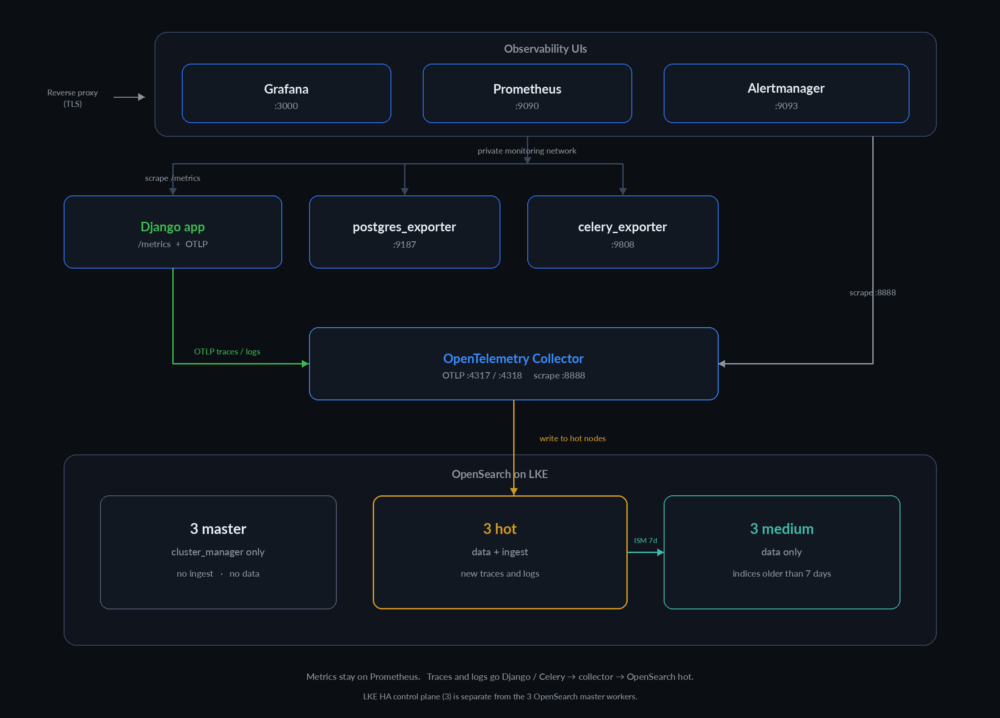

# DjangoObserve

Production monitoring stack for Django + PostgreSQL + Celery  
Prometheus · Grafana · Alertmanager · OpenTelemetry Collector · exporters

Dashboards are provisioned automatically:

| Dashboard | Source ID |
|-----------|-----------|
| Django | [17658](https://grafana.com/grafana/dashboards/17658) |
| PostgreSQL | [9628](https://grafana.com/grafana/dashboards/9628) |
| Celery | [17508](https://grafana.com/grafana/dashboards/17508) |

## Quick start

```bash
cp .env.example .env
# Edit .env: Grafana password, Postgres DSN, Redis/Celery broker, Django scrape target

docker-compose -f docker-compose.monitoring.yml up -d
```

| Service | Default URL (localhost-bound) |
|---------|-------------------------------|
| Grafana | http://127.0.0.1:3000 |
| Prometheus | http://127.0.0.1:9090 |
| Alertmanager | http://127.0.0.1:9093 |
| OTLP gRPC | `127.0.0.1:4317` |
| OTLP HTTP | `127.0.0.1:4318` |
| Flower | not published — attach to the network or publish behind a reverse proxy |

Exporter ports (`9187`, `9808`) and collector internals (`8888`, `13133`) stay on the private `monitoring` network only.

## Architecture



## Wire up your Django app

1. Install and configure `django-prometheus`:

```bash
pip install django-prometheus
```

```python
INSTALLED_APPS += ["django_prometheus"]

MIDDLEWARE = [
    "django_prometheus.middleware.PrometheusBeforeMiddleware",
    # ... your middleware ...
    "django_prometheus.middleware.PrometheusAfterMiddleware",
]

DATABASES = {
    "default": {
        "ENGINE": "django_prometheus.db.backends.postgresql",
        # ...
    }
}
```

```python
# urls.py
urlpatterns = [
    path("", include("django_prometheus.urls")),
    # ...
]
```

2. Point the stack at your metrics endpoint in `.env`:

```bash
# Django on the host, monitoring in Docker:
DJANGO_METRICS_TARGET=host.docker.internal:8000

# Django as another Compose service on a shared network:
DJANGO_METRICS_TARGET=web:8000
```

3. Restrict `/metrics` in production (firewall, allowlist Prometheus IPs, or auth). Do not expose it publicly.

## Wire up OpenTelemetry

The collector accepts OTLP traces, metrics, and logs. Until Tempo/Loki are added, telemetry is written to the collector logs (`debug` exporter) so you can confirm the pipeline.

1. Install the SDK and instrumentations in your Django app:

```bash
pip install opentelemetry-sdk opentelemetry-exporter-otlp \
  opentelemetry-instrumentation-django \
  opentelemetry-instrumentation-psycopg \
  opentelemetry-instrumentation-celery \
  opentelemetry-instrumentation-redis
```

2. Point the app at the collector:

```bash
# Django on the host, monitoring in Docker:
export OTEL_SERVICE_NAME=django
export OTEL_EXPORTER_OTLP_ENDPOINT=http://127.0.0.1:4318
export OTEL_EXPORTER_OTLP_PROTOCOL=http/protobuf

# Django as another Compose service on a shared network:
# export OTEL_EXPORTER_OTLP_ENDPOINT=http://otel-collector:4317
# export OTEL_EXPORTER_OTLP_PROTOCOL=grpc
```

Keep `django-prometheus` for Grafana dashboards and alerts. Do not send the same RED metrics through OTLP yet — that would duplicate series.

3. Confirm spans arrive:

```bash
docker-compose -f docker-compose.monitoring.yml logs -f otel-collector
```

OTLP has no authentication. Leave the ports on `127.0.0.1` or put the collector behind a mesh/proxy that enforces TLS and auth.

## Postgres exporter

Create a read-only monitoring role if you can:

```sql
CREATE USER monitor_user WITH PASSWORD 'secret';
GRANT pg_monitor TO monitor_user;
```

Then set:

```bash
POSTGRES_EXPORTER_DATA_SOURCE_NAME=postgresql://monitor_user:secret@db:5432/postgres?sslmode=require
```

If Postgres is not on the Compose network, use the host IP / `host.docker.internal` and ensure the network allows the connection.

## Celery / Flower

```bash
CELERY_BROKER_URL=redis://:password@redis:6379/1
FLOWER_BASIC_AUTH=admin:strong-password
```

Celery workers should emit events for richer exporter metrics:

```bash
celery -A your_project worker -E
```

To use Flower's UI in production, put it behind TLS + SSO (or publish only on localhost):

```yaml
# optional overlay snippet
services:
  flower:
    ports:
      - "127.0.0.1:5555:5555"
```

## Alerting

Default rules live in `prometheus/rules/alerts.yml` (target down, Django 5xx/latency, Postgres connections, Celery failures).

Alertmanager starts with a no-op receiver (alerts visible in the UI). For Slack:

```bash
cp alertmanager/alertmanager.slack.yml.example alertmanager/alertmanager.yml
# set slack_api_url / channel, then:
docker-compose -f docker-compose.monitoring.yml up -d alertmanager
```

## Production notes

- Secrets live in `.env` (gitignored). Never commit real passwords.
- UIs and OTLP receivers bind to `127.0.0.1` by default — put Grafana behind Nginx/Traefik/Caddy with TLS and real auth (OAuth/LDAP) for public access. Do not publish `4317`/`4318` on a public interface.
- Prometheus retention defaults to `15d` / `10GB` (override in `.env`).
- Dashboards and the Prometheus datasource are provisioned from `grafana/`; rebuilds stay reproducible.
- Prefer `sslmode=require` (or stronger) for Postgres when not on a private network.

### Prometheus volume permissions (Linux)

If Prometheus exits with permission errors on `/prometheus`, fix the named volume once:

```bash
docker run --rm -v "$(basename "$PWD")_prometheus_data:/p" busybox chown -R 65534:65534 /p
```

Then start the stack again.

## Useful commands

```bash
docker-compose -f docker-compose.monitoring.yml ps
docker-compose -f docker-compose.monitoring.yml logs -f prometheus
docker-compose -f docker-compose.monitoring.yml logs -f otel-collector
docker-compose -f docker-compose.monitoring.yml down
```
